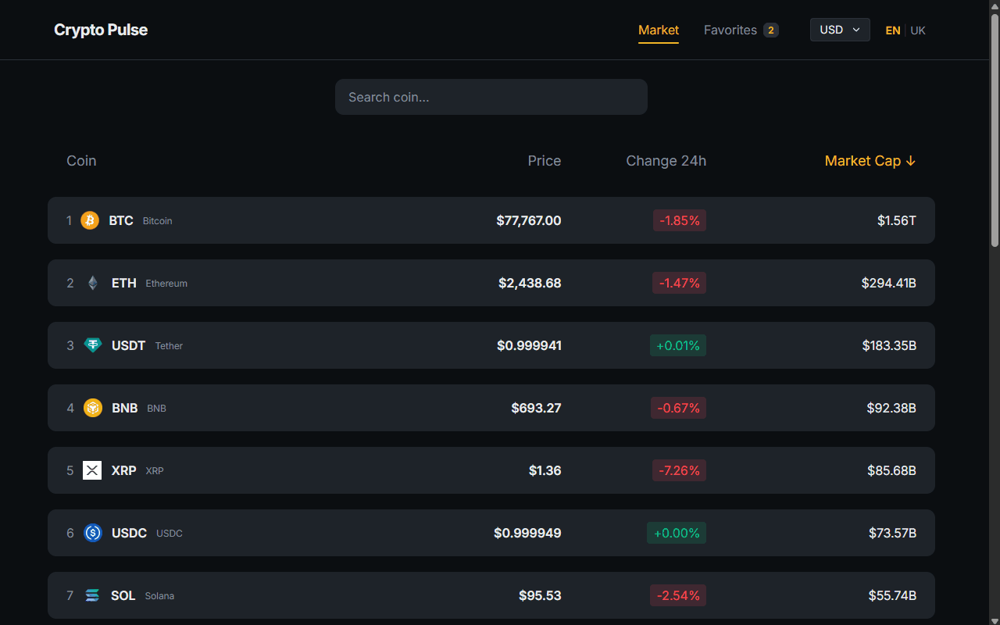

# 🪙 Crypto-Pulse

A real-time cryptocurrency tracker built to practice external API integration, React hooks, and state management.

**[Live demo →](https://crypto-pulse-sigma-six.vercel.app)**

## Features

- Real-time prices for the top 100 cryptocurrencies via the CoinGecko API
- Loading state with a dedicated loader during data fetching
- Interactive price charts on detailed coin pages (Chart.js)
- Search and filter across the coin list
- Favorites list with persistence via local storage
- Dark-themed, responsive UI
- API keys kept out of source control via environment variables

## Tech stack

| Category | Technology                        |
| -------- | --------------------------------- |
| Frontend | React, TypeScript, Vite           |
| Styling  | CSS3 (custom properties, Flexbox) |
| Charts   | Chart.js                          |
| Data     | CoinGecko API                     |

## Running locally

\`\`\`
git clone https://github.com/Atsui04/crypto-pulse.git
cd crypto-pulse
npm install
\`\`\`

Create a `.env` file in the project root:

\`\`\`
VITE_COINGECKO_API_KEY=your_actual_key_here
\`\`\`

Get a free demo API key from [CoinGecko](https://www.coingecko.com/en/api).

\`\`\`
npm run dev
\`\`\`

## Project structure

\`\`\`
src/
api/ # services for external HTTP requests
components/ # reusable UI components
styles/ # global styles and dark theme config
\`\`\`
